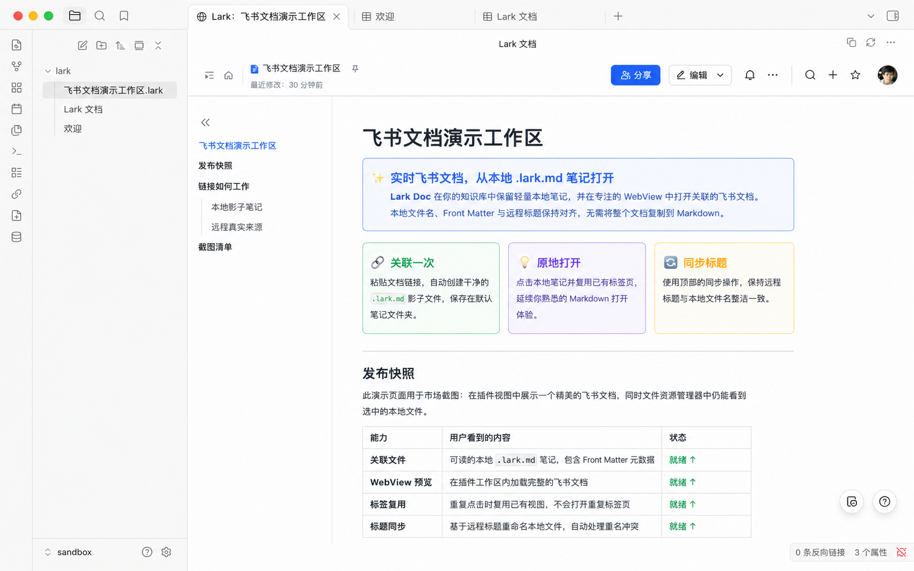
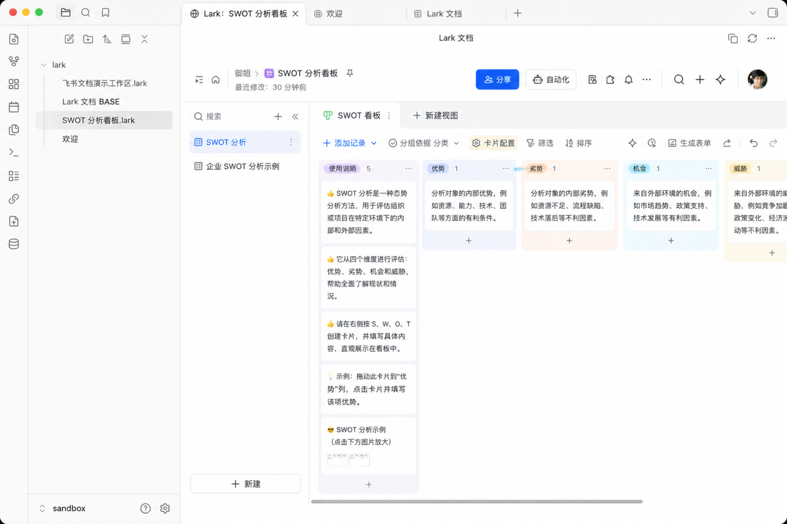
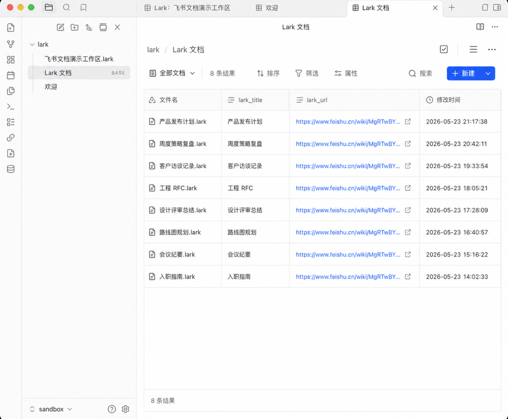

<p align="center">
  
</p>

# Lark Wiki


Lark Wiki 用于连接 Obsidian 本地笔记和 Lark / 飞书云文档、多维表格。它会在 vault 中保留轻量的 `.lark.md` 文件，在 Obsidian WebView 中打开关联的远端资源，并可让本地文件名与远端标题保持同步。

[English](README.md)

## 截图

打开本地 `.lark.md` 笔记，即可在 Obsidian 中直接查看关联的 Lark / 飞书文档。



打开关联的 Lark / 飞书多维表格链接时，也会在同一个聚焦的 WebView 中呈现，并保留选中的数据表和视图。



通过自动生成的 `Lark Documents.base` 视图集中浏览已关联文档。



## 功能

- 打开 `.lark.md` 文件时，自动在 Obsidian 内打开对应的 Lark / 飞书文档预览。
- 支持打开 Lark / 飞书多维表格 `/base/...` 链接，并保留选中的 `table` 和 `view`。
- 同一个 `.lark.md` 文件重复点击时复用已有标签页，行为接近普通 Markdown 文件。
- 通过 `Add linked Lark document` 输入文档或多维表格 URL，在默认笔记目录中创建对应的 `.lark.md` 文件。
- 通过 `Create Lark document` 输入标题并选择文档或多维表格，创建远端 Lark / 飞书资源并在本地生成关联文件。
- 从 Lark / 飞书同步文档标题，并可把标题同步到 Obsidian 文件名。
- 可在预览视图顶部复制当前 Lark / 飞书文档链接。
- 文件名冲突时自动追加索引后缀，例如 `Product Spec 1.lark.md`。
- 在默认笔记目录中维护 `Lark Documents.base`，用于集中查看关联文档。
- 支持插件界面语言配置：自动、English、简体中文。

## 使用前提

- Obsidian Desktop。插件使用 WebView，因此是桌面端插件。
- 已安装并登录可用的 `lark-cli`。
- Lark / 飞书 URL 需要是 `feishu.cn` 或 `larksuite.com` 的 `docs`、`docx`、`wiki`、`base` 链接。

## 使用方式

1. 在插件设置中配置 `Lark CLI path`，默认使用 `lark-cli`；如果桌面端无法找到它，请填写绝对路径。如果你使用 fnm、nvm 或其他 Node 管理工具，请指向 `bin/lark-cli` 可执行文件。
2. 设置 `Default note folder`，默认是 `Lark`。新建的关联文件和 `Lark Documents.base` 都会放在这里。
3. 执行命令 `Add linked Lark document`，输入已有 Lark / 飞书文档或多维表格 URL。
4. 对于多维表格，`https://my.feishu.cn/base/...?...table=...&view=...` 这类链接会保留目标数据表和视图。
5. 插件会读取远端标题，并创建 `标题.lark.md`。
6. 在 Obsidian 中打开该 `.lark.md` 文件，即可在插件视图中查看远端文档或多维表格。
7. 如需创建新的远端资源，执行 `Create Lark document`，输入标题，并选择创建文档或多维表格。
8. 点击视图顶部的同步按钮，可以主动同步远端标题和本地文件名；点击复制按钮可以复制远端链接。

## 本地文件格式

`.lark.md` 文件只保存关联元数据和一个简短说明，真实内容仍保存在 Lark / 飞书中。插件会使用 `lark_doc_id`、`lark_url` 和 `lark_title` 这三个 Front matter 字段记录文档或多维表格 token、URL 和缓存标题。

## 安全与权限说明

- 插件通过 vault API 读取、创建和更新笔记，运行时代码不使用 Node.js `fs`。
- 创建文档或获取标题时，插件会通过 `child_process.spawn` 调用已配置的 `lark-cli`，参数固定，并设置 `shell: false`。
- 后台标题同步默认关闭。启用后，插件会枚举 vault 中的 Markdown 文件路径，用来查找关联的 `.lark.md` 笔记。

## 开发

```bash
npm install
npm run dev
npm run lint
npm test
npm run test:coverage
npm run build
```

构建后的 Obsidian 插件文件为：

- `manifest.json`
- `main.js`
- `styles.css`

发布流程和社区提交前检查见 [Release guide](doc/release.md)，变更记录见 [CHANGELOG.md](CHANGELOG.md)。
