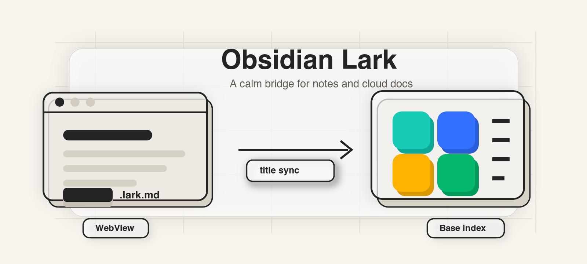
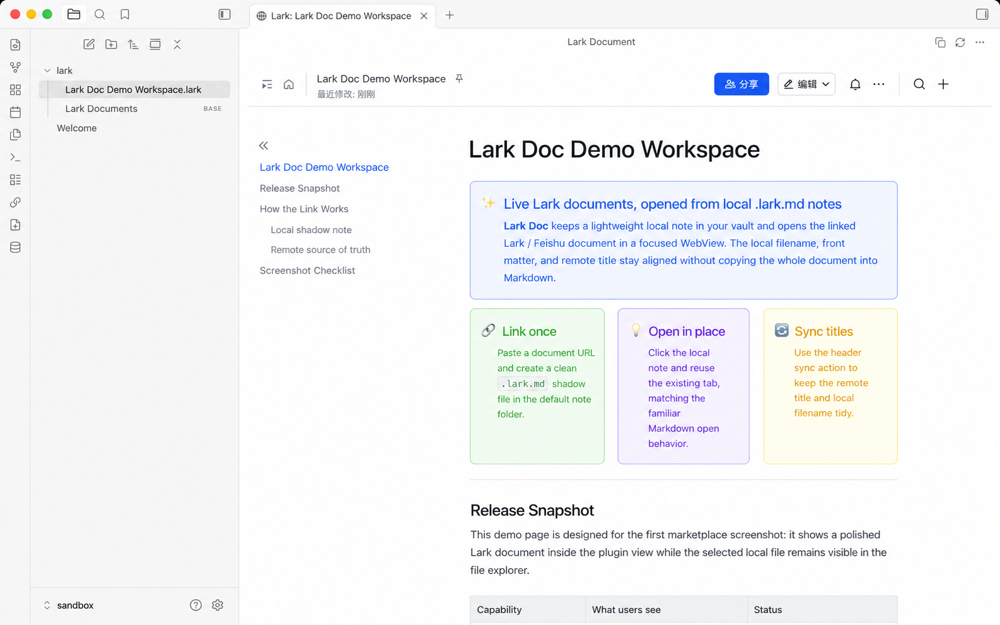
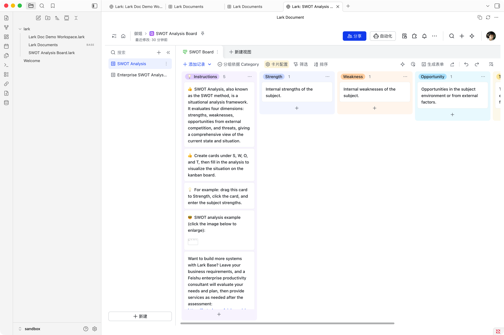
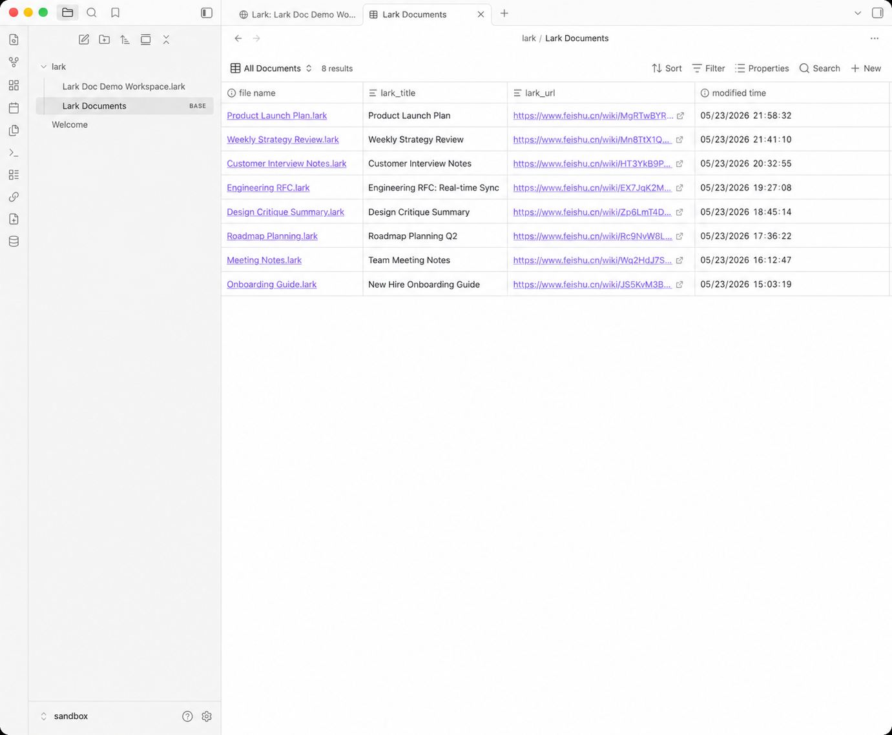

<p align="center">
  
</p>

# Lark Wiki



Lark Wiki connects local Obsidian notes with Lark / Feishu cloud documents and Bases. It keeps a lightweight `.lark.md` file in your vault, opens the linked remote resource in an Obsidian WebView, and can keep the local filename aligned with the remote title.

[中文说明](README-CN.md)

## Screenshots

Open a local `.lark.md` note and view the linked Lark / Feishu document directly inside Obsidian.



Open linked Lark / Feishu Base URLs in the same focused WebView, with the selected table and view preserved.



Browse linked documents from the generated `Lark Documents.base` view.



## Features

- Automatically opens the linked Lark / Feishu document when a `.lark.md` file is opened in Obsidian.
- Opens linked Lark / Feishu Bases from `/base/...` URLs, preserving the selected `table` and `view`.
- Reuses the existing tab for the same `.lark.md` file, matching normal Markdown file behavior.
- Creates a local `.lark.md` file from an existing document or Base URL through `Add linked Lark document`.
- Creates a remote Lark / Feishu document or Base and a local linked note through `Create Lark document`.
- Syncs document titles from Lark / Feishu and can rename the local Obsidian file.
- Copies the current Lark / Feishu document link from the preview header.
- Appends an indexed suffix when a synced filename would collide, such as `Product Spec 1.lark.md`.
- Maintains `Lark Documents.base` in the default note folder for browsing linked documents.
- Supports configurable UI language: Auto, English, and Simplified Chinese.

## Requirements

- Obsidian Desktop. This plugin uses WebView and is desktop-only.
- A working authenticated `lark-cli` installation.
- Supported URLs are `docs`, `docx`, `wiki`, and `base` links on `feishu.cn` or `larksuite.com`.

## Usage

1. Configure `Lark CLI path` in plugin settings. The default is `lark-cli`; use an absolute path if the desktop app cannot find it. If you use fnm, nvm, or another Node manager, point this setting to the `bin/lark-cli` executable.
2. Configure `Default note folder`. The default is `Lark`; linked notes and `Lark Documents.base` are created there.
3. Run `Add linked Lark document` and paste an existing Lark / Feishu document or Base URL.
4. For Base links, URLs such as `https://my.feishu.cn/base/...?...table=...&view=...` keep the target table and view in the local link.
5. The plugin fetches the remote title and creates `Title.lark.md`.
6. Open the `.lark.md` file in Obsidian to view the remote document or Base inside the plugin view.
7. To create a new remote resource, run `Create Lark document`, enter a title, and choose either Document or Base.
8. Use the sync button in the view header to manually sync the remote title and local filename, or the copy button to copy the remote link.

## Local File Format

`.lark.md` files are local proxy notes. They store only metadata and a short explanation; the full content stays in Lark / Feishu. The plugin uses `lark_doc_id`, `lark_url`, and `lark_title` Front matter fields for the document or Base token, URL, and cached title.

## Security and Permissions

- The plugin uses the vault API for note reads, creates, and updates. It does not use Node.js `fs` in runtime plugin code.
- The plugin runs the configured `lark-cli` executable with fixed arguments through `child_process.spawn` and `shell: false` when creating documents or fetching titles.
- Background title sync is disabled by default. If enabled, it enumerates Markdown file paths in the vault to find linked `.lark.md` notes.

## Development

```bash
npm install
npm run dev
npm run lint
npm test
npm run test:coverage
npm run build
```

Release assets for Obsidian:

- `manifest.json`
- `main.js`
- `styles.css`

See [Release guide](doc/release.md) for the automated release and community submission check workflow.
Changes are tracked in [CHANGELOG.md](CHANGELOG.md).
